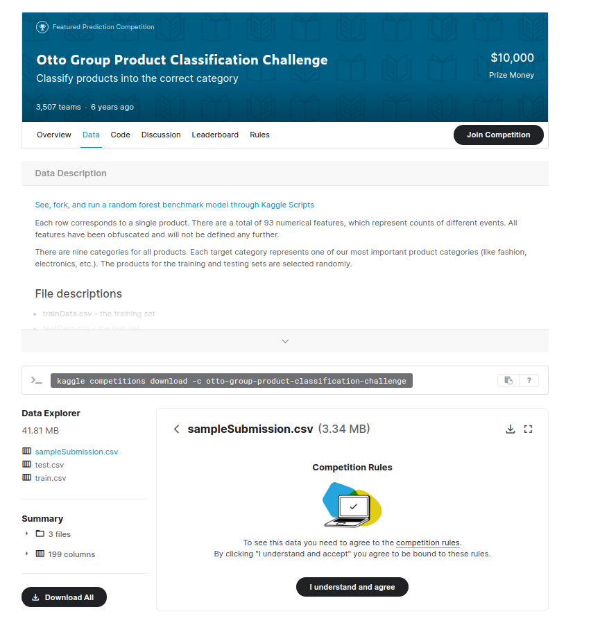

# amplify-hackathon

## 実行方法

### アクセストークンについて

様々なファイルで使うのでローカルファイルから呼び出すようにしています。

`~/.amplify/token.json`に以下のjson形式で保存してください。

```~/.amplify/token.json
{
    "AMPLIFY_TOKEN": "YOUR TOKEN"
}
```

### 動作確認

全てDocker上で動かせます。 ターミナルで以下のコードを打ってトークンが存在するか確認してください。

```bash
docker-compose up check
```

```
# OK
Your token file exists.

# Bad (トークンファイルが見つからない)
Your token file doesn't exist.
```

### MNIST

```bash
docker-compose up run-mnist
```

MNISTの学習をします。  \
実行すると下のように進捗と結果を出力します。

```bash
run-mnist_1  | energy:  803.6696062499832
run-mnist_1  | time: 10.15 s
run-mnist_1  | energy:  803.2545875004947
run-mnist_1  | time: 13.138 s
run-mnist_1  | energy:  803.5983125001565
run-mnist_1  | time: 16.123 s
run-mnist_1  | energy:  803.4165125006213
run-mnist_1  | time: 19.112 s
run-mnist_1  | energy:  803.2492500003998
run-mnist_1  | time: 22.143 s
run-mnist_1  | ==================== 0 ====================
run-mnist_1  | AUC: 0.9766666666666667
run-mnist_1  | ACC: 0.9166666666666666
run-mnist_1  | ===========================================
run-mnist_1  | energy:  802.9704062497967
run-mnist_1  | time: 11.497 s
run-mnist_1  | energy:  803.410518749836
run-mnist_1  | time: 14.544 s
run-mnist_1  | energy:  803.4836625000177
run-mnist_1  | time: 17.529 s
run-mnist_1  | energy:  803.1810312498983
run-mnist_1  | time: 20.54 s
run-mnist_1  | energy:  803.1730187497739
run-mnist_1  | time: 23.525 s
run-mnist_1  | ==================== 1 ====================
run-mnist_1  | AUC: 0.9924888888888889
run-mnist_1  | ACC: 0.8166666666666667
run-mnist_1  | ===========================================
...
```

### Fashion MNIST
```bash
docker-compose up run-fashion-mnist
```

### EMNIST
```bash
docker-compose up run-emnist
```

### otto
下に書いた方法でデータをダウンロードしてから
```bash
docker-compose up run-otto
```

## データセットについて

#### MNIST

[Digit Recognizer | Kaggle](https://www.kaggle.com/c/digit-recognizer) のデータセットを使っています。  
これはMNISTのデータが扱いやすいcsv形式に変換されたものです。

- `train.csv`: そのままのデータ
- `train_400.csv`: 28x28(pixels)から20x20(pixels)に変換した後のデータ

`train_400.csv`の作成は`src/resize.py`を用いました。

#### Fashion MNIST
[Fashion MNIST | Kaggle](https://www.kaggle.com/zalando-research/fashionmnist)　のデータセットを使っています。
`data/fashion_train_400.csv`ですが、作成方法は上と同じです。
元データは100MBを超えるのでGitHubにアップロードできませんでした。

#### EMNIST
[EMNIST (Extended MNIST)](https://www.kaggle.com/crawford/emnist) のデータセットを使っています。

`data/emnist_train_400.csv`は上のデータセットの`emnist-letters-test.csv`をMNISTと同様に処理したものです。

> Cohen, G., Afshar, S., Tapson, J., & van Schaik, A. (2017). EMNIST: an extension of MNIST to handwritten letters. Retrieved from http://arxiv.org/abs/1702.05373

#### otto
[Otto Group Product Classification Challenge](https://www.kaggle.com/c/otto-group-product-classification-challenge) というKaggleのコンペのデータです。  
入力は93個の特徴量、出力は9クラスの多クラス分類のタスクです。

[このリンクの先で](https://www.kaggle.com/c/otto-group-product-classification-challenge/data) Kaggleにログインし、`Join Competition`
を押してから下の画面のtrain.csvをダウンロードしてください。


ダウンロードしたファイルを解凍したら、`train.csv`をこのディレクトリの`data/otto-train.csv` に移動することでデータが利用できます。

## エラーについて

たまに学習時、以下のようなエラーが発生します。~~原因はよくわかってないので、実行し直す、分割して実行するなどして対処してください。~~ 

サーバーが高負荷になるのが原因のようです。何度か再実行すれば上手くいくはずです。

```bash
RuntimeError: Incorrect Content-Type: must be textual to extract_string, JSON to extract_json.
```

```bash
RuntimeError: 502 Bad Gateway
```

```bash
RuntimeError: Failed to read HTTP status line
```